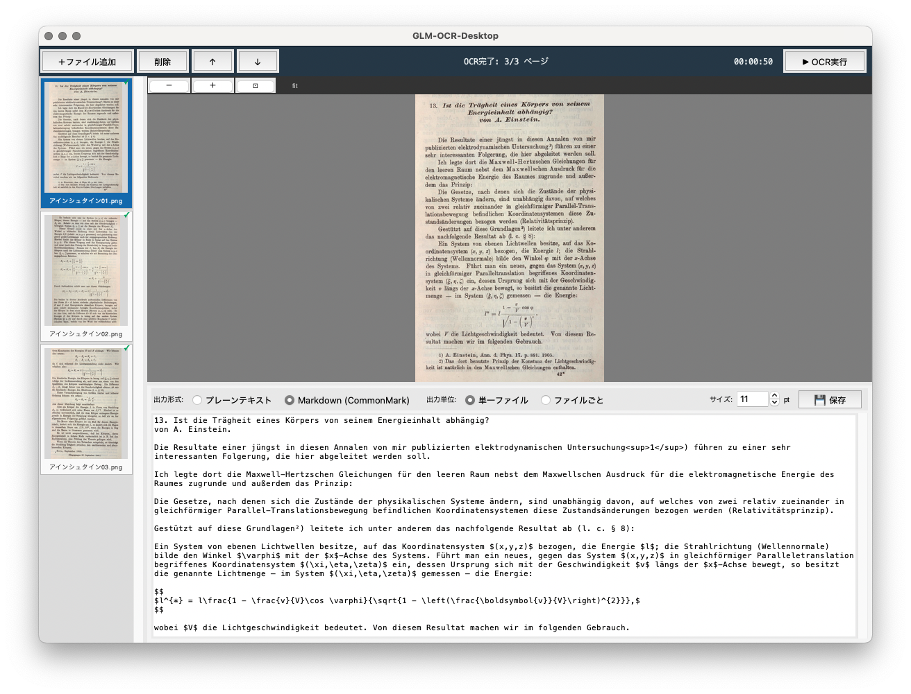

# GLM-OCR-Desktop

**[English](./README.md)** | **[日本語](./README_ja.md)** | **Deutsch**


## Über dieses Projekt

GLM-OCR-Desktop ist ein Desktop-GUI-Tool, das PDF-, PNG- und JPG-Dateien einliest und OCR-Ergebnisse als **Markdown** oder **Nur-Text** ausgibt.

- **Textbasierte PDFs** werden direkt extrahiert, ohne das KI-Modell zu verwenden — schnell und präzise
- **Bild-PDFs sowie PNG/JPG** werden mit Layoutanalyse + GLM-OCR (VLM) verarbeitet
- **UI-Sprache wird automatisch erkannt**: Japanisch / Englisch / Deutsch

### Verarbeitungsablauf

```
Eingabe
  ├─ PDF (Text eingebettet)  →  Layoutanalyse + direkte Textextraktion  →  Markdown / Nur-Text
  ├─ PDF (nur Bilder)        →  Layoutanalyse + GLM-OCR (VLM)           →  Markdown / Nur-Text
  └─ PNG / JPG               →  Layoutanalyse + GLM-OCR (VLM)           →  Markdown / Nur-Text
```

## Screenshot



## Schnellinstallation

Im Ordner `easy_installer/` befinden sich Installationsskripte für macOS und Windows.
Doppelklicken Sie auf die Datei für Ihr Betriebssystem und Ihre bevorzugte Sprache:

| BS | Sprache | Datei |
|----|---------|-------|
| macOS | Deutsch | `easy_installer/mac_de/glmocr_mac_installer_de.command` |
| macOS | English | `easy_installer/mac_en/glmocr_mac_installer_en.command` |
| macOS | 日本語 | `easy_installer/mac_ja/glmocr_mac_installer_ja.command` |
| Windows | Deutsch | `easy_installer/win_de/glmocr_win_installer_de.bat` |
| Windows | English | `easy_installer/win_en/glmocr_win_installer_en.bat` |
| Windows | 日本語 | `easy_installer/win_ja/glmocr_win_installer_ja.bat` |

Das Installationsprogramm richtet Schritt für Schritt alles ein: Python 3.11, virtuelle Umgebung, Pakete und KI-Modell-Downloads.

Für die manuelle Installation siehe [Voraussetzungen](#voraussetzungen) weiter unten.

## Voraussetzungen

### Betriebssystem

- macOS 11 oder neuer (Apple Silicon / Intel)
- Windows 10 oder neuer

### Python

Python 3.11 von [python.org](https://www.python.org/downloads/release/python-3119/) ist erforderlich.
Die python.org-Version enthält tkinter, das in der Homebrew-Version von Python unter macOS nicht verfügbar ist.

## Benötigter Speicherplatz

Der folgende freie Speicherplatz wird benötigt:

| Element | Größe |
|---------|-------|
| GLM-OCR-Modell | ~2,5 GB |
| PP-DocLayoutV3-Modell | ~127 MB |
| Virtuelle Python-Umgebung (torch usw.) | ~1 GB |
| **Gesamt** | **~4 GB** |

## Starten

Nach der Installation:

- **macOS**: `GLM-OCR-Desktop.command` doppelklicken
  *(Beim ersten Mal: Rechtsklick → Öffnen, um Gatekeeper zu umgehen)*
- **Windows**: `GLM-OCR-Desktop.bat` doppelklicken
- **CLI**: `.venv_bundle/bin/python main.py`

## Verwendung

1. Klicken Sie auf **＋Datei hinzufügen** oder ziehen Sie PDF / PNG / JPG-Dateien per Drag & Drop
2. Klicken Sie auf **▶ OCR starten**
3. Wählen Sie das Ausgabeformat (**Markdown** oder Nur-Text) und klicken Sie auf **💾 Speichern**

Mehrere Seiten können gleichzeitig ausgewählt und verarbeitet werden.

## Unterstützte Formate

| Eingabe | Ausgabe |
|---------|---------|
| PDF (Text eingebettet) | Markdown / Nur-Text |
| PDF (nur Bilder) | Markdown / Nur-Text |
| PNG / JPG | Markdown / Nur-Text |

## Markdown-Ausgabe

Bei der Auswahl von Markdown wird die Dokumentstruktur beibehalten:

- Dokumenttitel → `#`-Überschrift
- Abschnittsüberschriften → `##`-Überschrift
- Tabellen → Markdown-Tabellenformat

Im Nur-Text-Modus wird unformatierter Text ohne Markdown-Notation ausgegeben.

## Ausgabemodus (Einzeldatei / Pro Datei)

Wenn Sie mehrere Dateien laden und OCR ausführen, können Sie beim Speichern den
Ausgabemodus wählen (diese Einstellung hat keine Auswirkung, wenn nur eine Eingabedatei
geladen wurde):

- **Einzeldatei**: Speichert die Ergebnisse aller Seiten zusammen in einer Datei (bisheriges Verhalten)
- **Pro Datei**: Speichert für jede Eingabedatei eine eigene Ausgabedatei.
  Der Dateiname der Ausgabe entspricht dem Namen der ursprünglichen Eingabedatei

Bei Auswahl von „Pro Datei" öffnet ein Klick auf Speichern lediglich einen
Ordnerauswahl-Dialog — eine Eingabe des Dateinamens ist nicht nötig. Bei doppelten
Dateinamen wird automatisch eine Nummer angehängt (`_2`, `_3` …).

## Tastaturkürzel

| Taste | Aktion |
|-------|--------|
| `↑` / `↓` | Miniaturansicht wechseln (bei Zoom: Vorschau vertikal verschieben) |
| `←` / `→` | Vorschau horizontal verschieben (nur bei Zoom) |
| Mausrad (auf Miniaturansicht) | Miniaturansicht wechseln |
| Mausrad (auf Vorschau) | Vorschau vertikal verschieben (nur bei Zoom) |
| `BackSpace` / `Delete` | Ausgewählte Seite(n) löschen (mit Bestätigung) |
| `Cmd+A` / `Strg+A` | Alle Seiten auswählen |
| `Shift+Klick` | Bereichsauswahl |
| `Cmd+Klick` / `Strg+Klick` | Einzelauswahl umschalten |
| Schließen-Schaltfläche (×) / `Cmd+Q` | Anwendung beenden |

## Autor

Kazuyuki Kuwano

## Lizenz

AGPL-3.0 — Einzelheiten siehe [LICENSE_de.md](./LICENSE_de.md).
